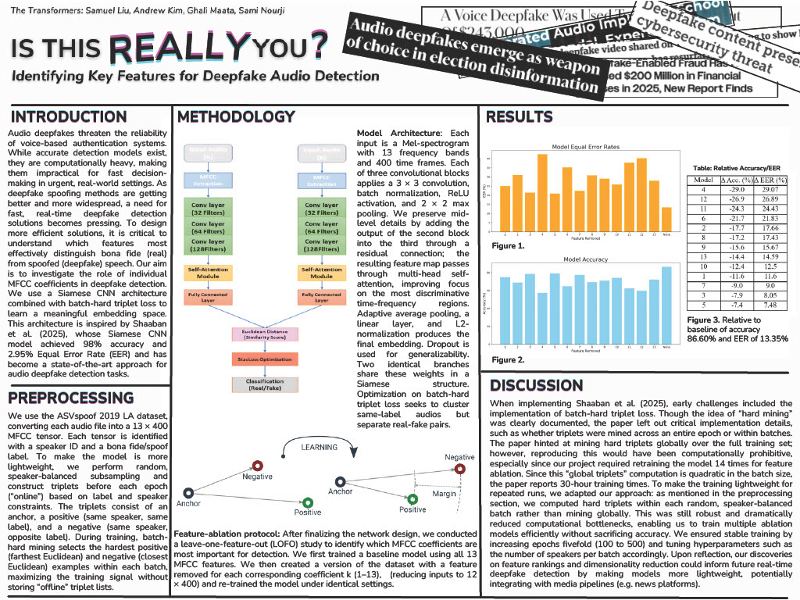

# DeepfakeAudioDetection



## Viewing the Results

Please see the `poster:report` directory to view the poster and reports!

## Downloading the Dataset 

1. Download the dataset by running the following command in your terminal:
```bash
wget -v https://datashare.ed.ac.uk/bitstream/handle/10283/3336/LA.zip
```

This will download the **LA.zip** file containing the data

2. Extract the contents of the zip file:
    ```bash
    unzip LA.zip
    ```

    This will create a directory containing the dataset files.

Make sure you have wget installed. If not, you can install it using your system’s package manager:
- On Ubuntu/Debian: `sudo apt-get install wget`
- On Mac (with Homebrew): `brew install wget`

This should take **~15 minutes** on Brown's OSCAR GPU grid. Otherwise, timing may vary depending on the device.

3. Enter the preprocess folder and run datasets.py:
    ```bash
    cd train
    python train.py
    ```

4. Return back to the root directory and enter the train folder to run train.py:
    ```bash
    cd ..
    cd train
    python train.py
    ```

5.  Return back to root directory and run the following for validation
    ```bash
    cd ..
    python validate.py
    ```